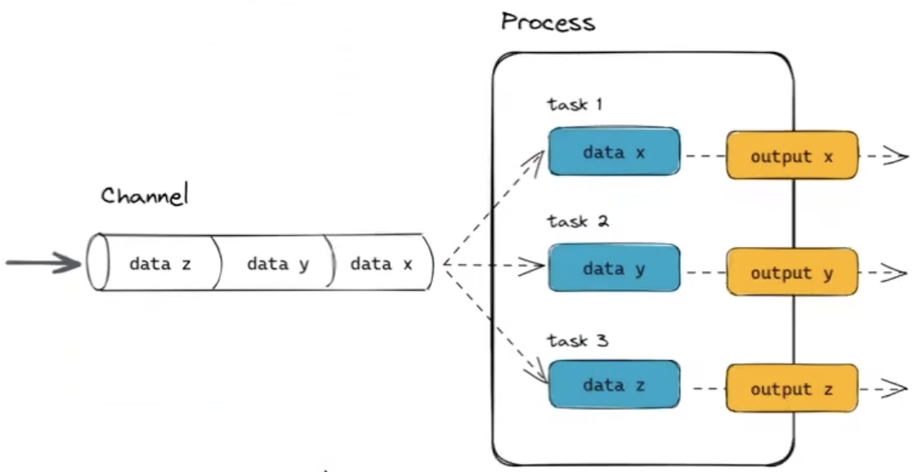

# Nextflow training tutorial

## Table of contents
- [Documentation](#doc) - relevant files
- [Notes](#notes) - notes

### Documentation 
1. https://training.nextflow.io/basic_training/#follow-the-training-videos
2. youtube.com/nf-core

### Notes  
1. Open community
2. Open science
3. Implicit parallelism
4. Reentrancy (checkpoints)

Developed especially for genomics workflows: in the same script you can have python and R script (and others).
Using the same pipeline and different platforms it happened to have different results: Nextflow tries to make the analysis as much reproducible as possible.
The 28% of all omics software resources are currently not accessible through URLs published in the paper; also, among the tools selected, 49% were difficult to install or could not be installed at all. Nextflow supports docker, podman, singularity and conda. It also sipport microsoft Azure. 

Basic Nextflow concepts:
1. channels: allows to processes to communicate 
2. processes: every step in the pipeline is a process
3. operators

### Commands

`nextflow info`

